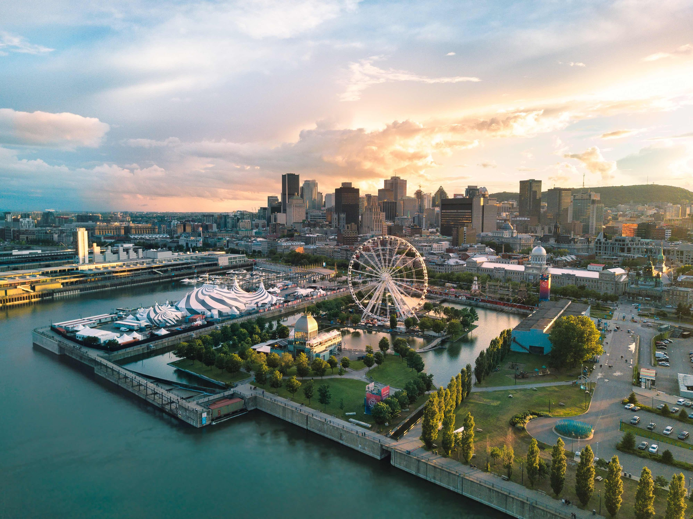
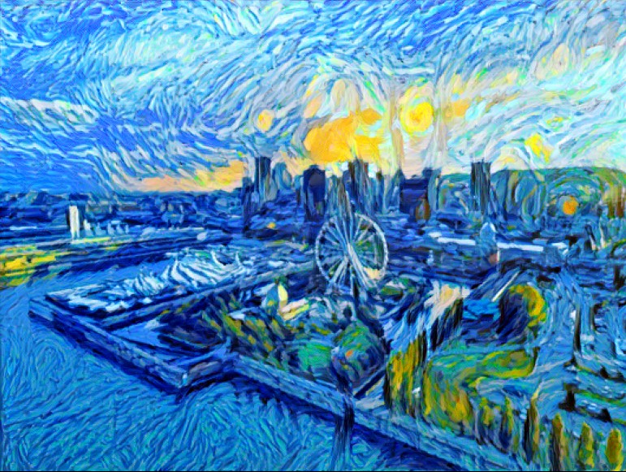

# StyleTransfer_CNNBased

Content

Style

Content + Style = Result

Let's begin by working with two images: one referred to as the "content image" and the other as the "style image." We extract features from the content image using layers of a Convolutional Neural Network (CNN), and similarly, we extract styles and textures from the style image. Our goal is to create a "target image" (output image) that combines the content and style.

To start, we have the option of creating an empty canvas for the target image. However, this would result in a significantly different target image with a high loss, making convergence challenging. Therefore, we initiate the target image as a copy of the content image. We then proceed to apply the style to it through regular backpropagation and optimization algorithms.

Now, to optimize the target image and minimize the loss, we define two essential components:

Content Loss: This measures the disparity between the target image and the content image. We compute this loss by finding the mean squared distance between the two images.

Style Loss: This evaluates the difference between the target image and the style image. To calculate the style loss, we introduce the concept of a "Gram matrix" and determine the squared distance between the Gram matrices of the two images.

We optimize the entire target image across multiple scales and layers, aiming to minimize the overall loss, which is the combination of the content loss and style loss. Ultimately, this optimization process yields our final output, which is the desired target image, effectively blending the content and style elements.
